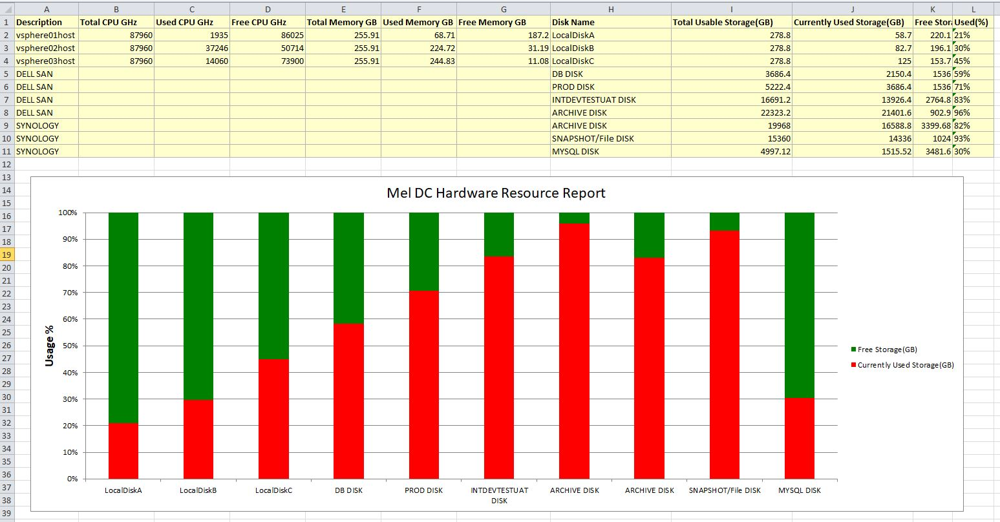
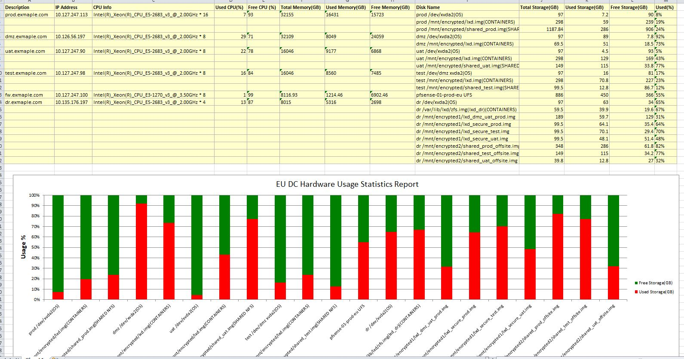

# Automations
Some automation ideas, I use [Rundeck](www.rundeck.com) to integreate with Bash shell, Ansible, Python script and Poweshell command.

# Table of Contents
- [1 Generate Vcenter hardware resource report](#1-generate-vcenter-hardware-resource-report)
- [2 Generate hardware resource report for Linux servers](#2-generate-hardware-resource-report-for-linux-servers)

## 1 Generate Vcenter hardware resource report
### 1.1 Requirements:
- ESXi local disks, SAN disks and NAS share disks usage
- ESXi CPU and Memory usage

In my environment, Mysql Server takes some disk sapce from SAN disk, NFS server takes some disk space from NAS share disk. The other disk space from SAN and NAS are all mounted on all the ESXi servers.

### 1.2 How to generate the Vcenter hardware resource report?
1. Collect Mysql server zpool usage [Bash + Ansible]
2. Collect NFS server zpool usage [Bash + Ansible]
3. Cpllect ESXi local disk usage [Bash + Ansible]
4. Collect ESXi shared disk usage [Bash + Ansible]
5. Collect ESXi CPU and Memory usage [Powershell]
6. Generate Execl Report [Python]

### 1.3 Output
- Step 1 - 4 can be put into [disk_usage.sh](generate-vcenter-hardware-resource-report/disk_usage.sh). Output is similar like:
```bash
PLAY [mysql] *******************************************************************

TASK [Check the zpool usage] ***************************************************
changed: [mysql.example.com]

TASK [debug] *******************************************************************
ok: [mysql.example.com] => {
    "myoutput.stdout_lines": [
        "NAME    SIZE  ALLOC   FREE  EXPANDSZ   FRAG    CAP  DEDUP  HEALTH  ALTROOT",
        "mysql  4.88T  1.48T  3.40T         -    35%    30%  1.00x  ONLINE  -"
    ]
}

PLAY [nfs] *********************************************************************

TASK [Check the zpool usage] ***************************************************
changed: [nfs.example.com]

TASK [debug] *******************************************************************
ok: [nfs.example.com] => {
    "myoutput.stdout_lines": [
        "NAME                 SIZE  ALLOC   FREE  EXPANDSZ   FRAG    CAP  DEDUP  HEALTH  ALTROOT",
        "data_archives       19.5T  16.2T  3.32T         -    66%    82%  1.00x  ONLINE  -"
    ]
}

PLAY [Meldc_esxi_hosts] ********************************************************

TASK [Check the local disk usage] **********************************************
changed: [vsphere02.example.com]
changed: [vsphere01.example.com]
changed: [vsphere03.example.com]

TASK [debug] *******************************************************************
ok: [vsphere01.example.com] => {
    "myoutput.stdout_lines": [
        "Filesystem   Size   Used Available Use% Mounted on",
        "VMFS-6     278.8G  58.7G    220.1G  21% /vmfs/volumes/LocalDiskA"
    ]
}
ok: [vsphere02.example.com] => {
    "myoutput.stdout_lines": [
        "Filesystem   Size   Used Available Use% Mounted on",
        "VMFS-6     278.8G  82.7G    196.1G  30% /vmfs/volumes/LocalDiskB"
    ]
}
ok: [vsphere03.example.com] => {
    "myoutput.stdout_lines": [
        "Filesystem   Size   Used Available Use% Mounted on",
        "VMFS-6     278.8G 125.0G    153.7G  45% /vmfs/volumes/LocalDiskC"
    ]
}

PLAY [vsphere01.example.com] **************************************************

TASK [Check the shared disk usage] *********************************************
changed: [vsphere01.example.com]

TASK [debug] *******************************************************************
ok: [vsphere01.example.com] => {
    "myoutput.stdout_lines": [
        "Filesystem   Size   Used Available Use% Mounted on",
        "NFS         15.0T  14.0T      1.0T  93% /vmfs/volumes/VM_SNAPSHOTS",
        "VMFS-6      21.8T  20.9T    902.9G  96% /vmfs/volumes/ARCHIVES_VDISK",
        "VMFS-6       3.6T   2.1T      1.5T  59% /vmfs/volumes/DB_VDISK",
        "VMFS-6       5.1T   3.6T      1.5T  71% /vmfs/volumes/PROD_VDISK",
        "VMFS-6      16.3T  13.6T      2.7T  83% /vmfs/volumes/INTDEVTESTUAT_VDISK"
    ]
}

PLAY RECAP *********************************************************************
mysql.example.com         : ok=2    changed=1    unreachable=0    failed=0
nfs.example.com           : ok=2    changed=1    unreachable=0    failed=0
vsphere01.example.com     : ok=4    changed=2    unreachable=0    failed=0
vsphere02.example.com     : ok=2    changed=1    unreachable=0    failed=0
vsphere03.example.com     : ok=2    changed=1    unreachable=0    failed=0

```
- Step 5 is [esxi_cpu_memory.sh](generate-vcenter-hardware-resource-report/esxi_cpu_memory.sh). Output is similar like:
```bash
Name                   ConnectionState PowerState NumCpu CpuUsageMhz CpuTotalMhz MemoryUsageGB MemoryTotalGB Version
----                   --------------- ---------- ------ ----------- ----------- ------------- ------------- -------
vsphere01.example.com Connected       PoweredOn      40       21050       87960        69,421       255,908   6.5.0
vsphere03.example.com Connected       PoweredOn      40       15764       87960       245,847       255,908   6.5.0
vsphere02.example.com Connected       PoweredOn      40       39644       87960       232,036       255,908   6.5.0
```
- Step 6 is [vcenter_hardware_resource_report.py](generate-vcenter-hardware-resource-report/vcenter_hardware_resource_report.py). 

The way to run the python script is:
```bash
#!/bin/bash
WORK_DIR=/var/lib/rundeck/work/ansible
TODAY=$(date "+%Y%m%d")

# Generate the excel file
cd $WORK_DIR/DataCenterDiskCapacity
source venv/bin/activate
python MelDcDiskUsage.py

if [ $? -eq 0 ]; then
    echo "Generate Excel file successfully"
else
    echo "Generate Excel file failed, please check with GPSSS INF team"
    exit 1
fi

# Send Email with the excel file
echo "Hi team, please review the MEL DC Hardware Resource Usage Report" | mutt -a $WORK_DIR/DataCenterDiskCapacity/MelDataCenterHardwareUsageReport.$TODAY.xlsx -s "MEL DC Hardware Resource Usage Report ${TODAY}" -- $requestor1 $requestor2 
```

Output is similar like: 

## 2 Generate hardware resource report for Linux servers

### 2.1 Requirements:
- local disks, share disks usage
- CPU and Memory usage

In my environment, I have a firewall server, it is also mounted disk which need to monitor, the firewall can be accessed through ssh via port 2222.

### 2.2 How to generate the Vcenter hardware resource report?
1. Collect zpool usage for lxd and shared disks [Bash + Ansible]
2. Collect local disk usage [Bash + Ansible]
3. Cpllect Memory usage [Bash + Ansible]
4. Collect CPU usage [Bash + Ansible]
5. Collect usage for Firewall seperately [Bash + Ansible]
6. Generate Execl Report [Python]

### 2.3 Output

Code can be found here. [generate_linux_hardware_resource_usage_report.sh](generate_linux_hardware_resource_usage_report/generate_linux_hardware_resource_usage_report.sh).
- Step 1 - 4 output is similar like:
```bash
PLAY [PROD] ********************************************************************

TASK [Check the zpool usage] ***************************************************
changed: [prod.exmaple.com]

TASK [debug] *******************************************************************
ok: [prod.exmaple.com] => {
    "myoutput.stdout_lines": [
        "NAME          SIZE  ALLOC   FREE  EXPANDSZ   FRAG    CAP  DEDUP  HEALTH  ALTROOT",
        "lxd           298G  59.0G   239G         -    60%    19%  1.00x  ONLINE  -",
        "shared_prod  1.16T   286G   906G         -    25%    24%  1.00x  ONLINE  -"
    ]
}

TASK [Check the local disk usage] **********************************************
changed: [prod.exmaple.com]

TASK [debug] *******************************************************************
ok: [prod.exmaple.com] => {
    "myoutput.stdout_lines": [
        "Filesystem                                                                   Size  Used Avail Use% Mounted on",
        "/dev/xvda2                                                                    97G  7.2G   90G   8% /"
    ]
}

TASK [Check the Memory Usage] **************************************************
changed: [prod.exmaple.com]

TASK [debug] *******************************************************************
ok: [prod.exmaple.com] => {
    "myoutput.stdout_lines": [
        "Memory_Usage: 32155 16431 15723"
    ]
}

TASK [Check the CPU Information] ***********************************************
changed: [prod.exmaple.com]

TASK [debug] *******************************************************************
ok: [prod.exmaple.com] => {
    "myoutput.stdout_lines": [
        "CPU_Info: Intel(R)_Xeon(R)_CPU_E5-2683_v3_@_2.00GHz 16 93"
    ]
}

PLAY RECAP *********************************************************************
prod.exmaple.com             : ok=8    changed=4    unreachable=0    failed=0
```

- Step 5 output is similar like:
```bash
PLAY [FW] **********************************************************************

TASK [Check the local disk usage] **********************************************
changed: [fw.exmaple.com]

TASK [debug] *******************************************************************
ok: [fw.exmaple.com] => {
    "myoutput.stdout_lines": [
        "Filesystem                     Size    Used   Avail Capacity  Mounted on",
        "/dev/ufsid/588f872bceb277db    886G    450G    366G    55%    /"
    ]
}

TASK [Check the Memory] ********************************************************
changed: [fw.exmaple.com]

TASK [debug] *******************************************************************
ok: [fw.exmaple.com] => {
    "myoutput.stdout_lines": [
        "Memory_Usage: 8116.93 1214.46 6902.46"
    ]
}

TASK [Check the CPU Information] ***********************************************
changed: [fw.exmaple.com]

TASK [debug] *******************************************************************
ok: [fw.exmaple.com] => {
    "myoutput.stdout_lines": [
        "CPU_Info: Intel(R)_Xeon(R)_CPU_E3-1270_v3_@_3.50GHz 8 99"
    ]
}

PLAY RECAP *********************************************************************
fw.exmaple.com             : ok=6    changed=3    unreachable=0    failed=0
```
- Step 6 output is similar like:


## 3 Create lxd Ubuntu containers snapshot and then do apt upgrade
### 3.1 Requirements:
- Having a good inventory of containers.
- Having a Rundeck procedure to do updates.

Something like:
- lxc snapshot
- lxc exec apt-get update && apt-get upgrade
- lxc stop
- lxc start
### 3.2 Output
1. lxc snapshot [Bash + Ansible]
```
###### Step 1: Go to vm-ubuntutest-01.test-01.b2be.com to run snapnshot for mcon-ubuntutest ######

PLAY [all] *********************************************************************

TASK [Take snapshot] ***********************************************************
changed: [vm-ubuntutest-01.test-01.b2be.com]

TASK [debug] *******************************************************************
ok: [vm-ubuntutest-01.test-01.b2be.com] => {
    "my.stdout_lines": [
        "Snapshots:", 
        "  upgrade-20190807 (taken at 2019/08/07 04:21 UTC) (stateless)"
    ]
}

PLAY RECAP *********************************************************************
vm-ubuntutest-01.test-01.b2be.com : ok=2    changed=1    unreachable=0    failed=0   

###### Step 2: Go to mcon-ubuntutest to run apt-get update and upgrade ######

```
2. apt-get update and apt-get upgrade [Bash + Ansible]
```
###### Step 2: Go to mcon-ubuntutest to run apt-get update and upgrade ######

PLAY [all] *********************************************************************

TASK [apt-get update and upgrade] **********************************************
 [WARNING]: Could not find aptitude. Using apt-get instead.
ok: [mcon-ubuntutest]

PLAY RECAP *********************************************************************
mcon-ubuntutest            : ok=1    changed=0    unreachable=0    failed=0   
```
3. Reboo the container [Bash + Ansible]
```
###### Step 3: Go to vm-ubuntutest-01.test-01.b2be.com to reboot mcon-ubuntutest ######

PLAY [all] *********************************************************************

TASK [Stop container mcon-ubuntutest] ******************************************
changed: [vm-ubuntutest-01.test-01.b2be.com]

TASK [debug] *******************************************************************
ok: [vm-ubuntutest-01.test-01.b2be.com] => {
    "my.stdout_lines": [
        "Status: Stopped"
    ]
}

TASK [Start container mcon-ubuntutest] *****************************************
changed: [vm-ubuntutest-01.test-01.b2be.com]

TASK [debug] *******************************************************************
ok: [vm-ubuntutest-01.test-01.b2be.com] => {
    "my.stdout_lines": [
        "Status: Running"
    ]
}

PLAY RECAP *********************************************************************
vm-ubuntutest-01.test-01.b2be.com : ok=4    changed=2    unreachable=0    failed=0   
```
